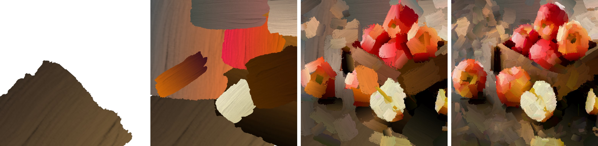
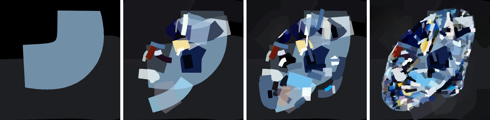

# neuralPainting


[](https://colab.research.google.com/drive/1N7VyYRvCUEZvK_qbiWu_YC1QCP01E9Wb#scrollTo=jt6O3GvhvK3i)

## setup

clone repository

```bash
git clone https://github.com/slowy07/neuralPainting.git
cd neuralPainting
```

download one of pretrained neural renderers from google drive

- [oil-paint-brush](https://drive.google.com/file/d/1sqWhgBKqaBJggl2A8sD1bLSq2_B1ScMG/view)
- [watercolor ink](https://drive.google.com/file/d/19Yrj15v9kHvWzkK9o_GSZtvQaJPmcRYQ/view?usp=sharing)
- [marker pen](https://drive.google.com/file/d/1XsjncjlSdQh2dbZ3X1qf1M8pDc8GLbNy/view?usp=sharing)
- [color tapes](https://drive.google.com/file/d/162ykmRX8TBGVRnJIof8NeqN7cuwwuzIF/view?usp=sharing)

```bash
unzip checkpoints_G_oilpaintbrush.zip
unzip checkpoints_G_rectangle.zip
unzip checkpoints_G_markerpen.zip
unzip checkpoints_G_watercolor.zip
```

We have also provided some lightweight renderers where users can generate high-resolution paintings on their local machine with limited GPU memory. Please feel free to download and unzip them to your repo directory

- [oil-paint-brush (light)](https://drive.google.com/file/d/1kcXsx2nDF3b3ryYOwm3BjmfwET9lfFht/view)
- [watercolor ink (light)](https://drive.google.com/file/d/1FoclmDOL6d1UT12-aCDwYMcXQKSK6IWA/view?usp=sharing)
- [marker pen (light)](https://drive.google.com/file/d/1pP99btR2XV3GtDHFXd8klpdQRSc0prLx/view?usp=sharing)
- [color tapes (light)](https://drive.google.com/file/d/1aHyc9ukObmCeaecs8o-a6p-SCjeKlvVZ/view?usp=sharing)

```bash
unzip checkpoints_G_oilpaintbrush_light.zip
unzip checkpoints_G_rectangle_light.zip
unzip checkpoints_G_markerpen_light.zip
unzip checkpoints_G_watercolor_light.zip
```

## to produce the result

<p align="center">
    
</p>

progressive rendering

```bash
python demo_prog.py --img_path ./test_images/apple.jpg --canvas_color 'white' --max_m_strokes 500 --max_divide 5 --renderer oilpaintbrush --renderer_checkpoint_dir checkpoints_G_oilpaintbrush --net_G zou-fusion-net
```

progressive rendering with lightweight (with lower GPU memmory and faster speed)

```bash
python demo_prog.py --img_path ./test_images/apple.jpg --canvas_color 'white' --max_m_strokes 500 --max_divide 5 --renderer oilpaintbrush --renderer_checkpoint_dir checkpoints_G_oilpaintbrush_light --net_G zou-fusion-net-light
```

rendering directly from mxm image grids

```bash
python demo.py --img_path ./test_images/apple.jpg --canvas_color 'white' --max_m_strokes 500 --m_grid 5 --renderer oilpaintbrush --renderer_checkpoint_dir checkpoints_G_oilpaintbrush --net_G zou-fusion-net
```

<p align="center">
    
</p>

progressive rendering

```bash
python demo_prog.py --img_path ./test_images/diamond.jpg --canvas_color 'black' --max_m_strokes 500 --max_divide 5 --renderer markerpen --renderer_checkpoint_dir checkpoints_G_markerpen --net_G zou-fusion-net
```

progressive rendering with lightweight (with lower GPU memmory and faster speed)

```bash
python demo_prog.py --img_path ./test_images/diamond.jpg --canvas_color 'black' --max_m_strokes 500 --max_divide 5 --renderer markerpen --renderer_checkpoint_dir checkpoints_G_markerpen_light --net_G zou-fusion-net-light
```

rendering directly from mxm image grids

```bash
python demo.py --img_path ./test_images/diamond.jpg --canvas_color 'black' --max_m_strokes 500 --m_grid 5 --renderer markerpen --renderer_checkpoint_dir checkpoints_G_markerpen --net_G zou-fusion-net
```
